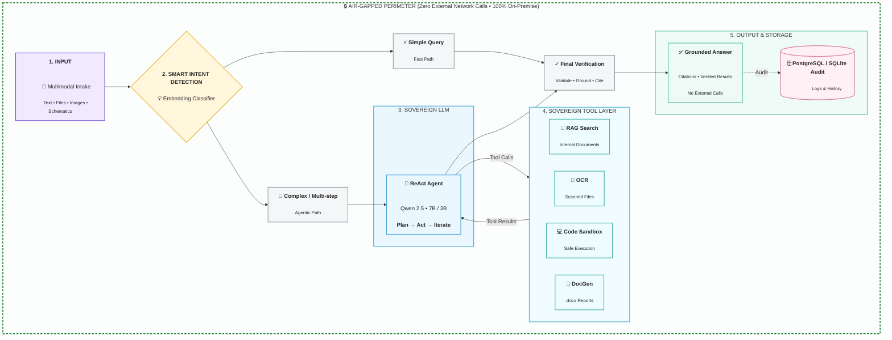
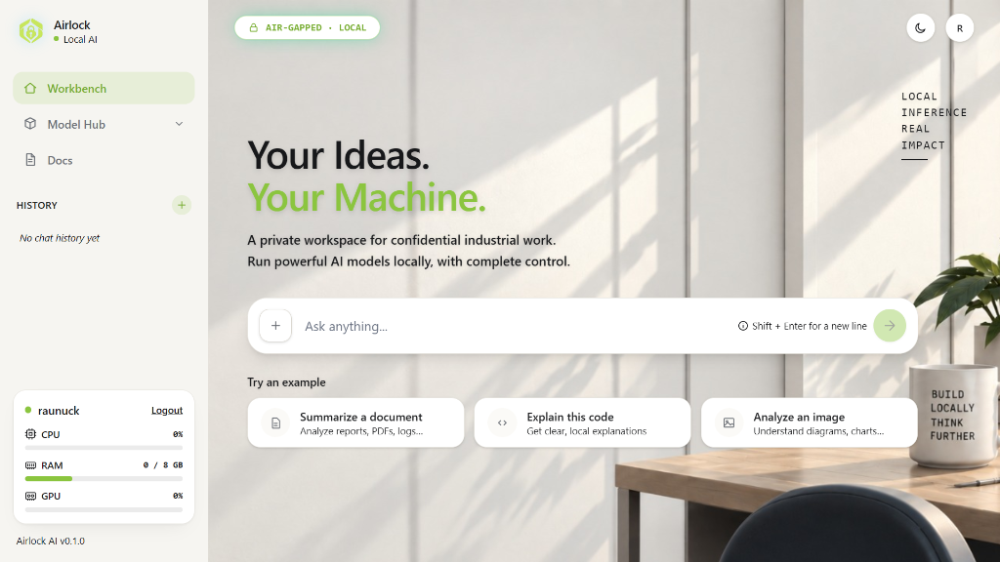

# Airlock AI

> **Sovereign, air-gapped agentic AI workbench built for confidential industrial operations.**

[](LICENSE)
[](https://www.sih.gov.in/)
[](docs/screenshots/dashboard.png)
[](https://www.python.org/)
[](https://react.dev/)
[](https://www.docker.com/)
[](https://github.com/vllm-project/vllm)

---

## Problem Statement

Confidential operational data across oil refineries, Public Sector Undertakings (PSUs), defense-linked manufacturing facilities, and strategic government offices cannot be routed through commercial cloud AI services due to national security mandates, strict compliance laws, and acute corporate espionage risks. Faced with strict air-gap and data sovereignty policies, engineering and administrative teams are forced into an unacceptable tradeoff: either sacrifice automated digital productivity, or risk leaking proprietary schematics, real-time sensor logs, and internal operating procedures to public cloud assistants. Airlock AI resolves this dilemma by delivering an enterprise-grade agentic workbench deployed entirely on-premise within an isolated physical and network boundary. By orchestrating open-weight models, sandboxed tool execution, and grounded internal document retrieval directly on local hardware, Airlock AI delivers state-of-the-art agentic automation with verifiable zero-egress isolation.

---

## Key Features / USP

- **Automatic Multi-Model Task Routing**: An embedding-based intent classifier evaluates query complexity, input modality, and required compute budget in real time. Workloads are dynamically routed to specialized local models (such as `Qwen 2.5-Coder:7b` for script synthesis, `Qwen 2.5:7b/3b` for multi-step reasoning, and `Qwen 2-VL` for schematics and image inspection), maximizing token throughput while respecting local VRAM limits.
- **Autonomous ReAct Agentic Loop**: Rather than functioning as a passive, single-shot chatbot, Airlock AI executes a full state-machine agentic cycle (**Plan → Tool Call → Observe → Iterate**). The agent formulates explicit execution plans, executes isolated system tools, inspects execution output or runtime errors, self-corrects broken logic, and validates final results prior to user presentation.
- **Multimodal Industrial Understanding**: Directly ingests and reasons across heterogeneous, field-collected inputs—including low-resolution scanned documents, handwritten maintenance handover sheets, valve inspection logs, and technical engineering drawings—powered by local OCR pipelines and local vision-language models.
- **Grounded RAG with Citations & Honest Refusal**: High-precision vector retrieval over proprietary plant Standard Operating Procedures (SOPs), safety regulations, and equipment manuals. The system provides exact file and section-level attributions for every claim and enforces strict refusal boundaries: when critical information is absent from internal documentation, it explicitly declines to guess or hallucinate.
- **Production Deliverable Generation**: Generates native, enterprise-formatted workplace deliverables ready for executive review, including formal Microsoft Word (`.docx`) approval notes and incident summaries, formatted PowerPoint (`.pptx`) operational briefings, Excel (`.xlsx`) audit sheets, and syntactically validated automation scripts.
- **Live, Provable Network Isolation**: Data sovereignty is verified mathematically rather than assumed. An integrated, real-time Proof Panel provides continuous packet capture (PCAP) inspection, socket monitoring, and hardware telemetry verifying 0.00 KB outbound WAN traffic and 100% localhost-bound inference.

---

## Tech Stack

| Function / Layer | Technologies | Architectural Role & Implementation Details |
| :--- | :--- | :--- |
| **Model Serving & Orchestration** | `vLLM`, `LangGraph`, `PostgreSQL Registry` | High-throughput local token generation, PagedAttention VRAM management, cyclic state graph orchestration, and dynamic task-to-model registry lookups. |
| **Open-Weight Models** | `Qwen 2.5 (7B / 3B Instruct)`, `Qwen 2.5-Coder (7B)`, `Qwen 2-VL` | Quantized local foundation models (AWQ/GGUF/FP16) optimized for instruction-following, zero-shot code synthesis, and multimodal schematic inspection. |
| **Backend & API** | `FastAPI`, `PostgreSQL`, `Redis` | Asynchronous REST and WebSocket endpoints, ACID-compliant audit logging, request queuing, and session state caching. |
| **Retrieval (RAG)** | `ChromaDB` / `Qdrant`, `bge-large-en-v1.5` | Fully local vector persistence, semantic recursive text chunking, metadata filtering over plant SOPs, and cosine similarity scoring. |
| **Agent Tooling** | `Docker Sandbox`, `python-docx`, `python-pptx`, `openpyxl`, `Tesseract OCR` | Ephemeral, network-disabled container execution for Python code validation, programmatic office document synthesis, and local image-to-text extraction. |
| **Frontend** | `React 19`, `Tailwind CSS`, `Vite`, `Lucide Icons` | Modern, responsive workbench interface with live hardware telemetry (GPU/CPU/VRAM), step trace inspector, and dark/light modes. |
| **Sovereignty Infrastructure** | `Air-Gapped Deployment`, `eBPF / libpcap Monitor`, `Signed Offline Bundles` | Hardware-level packet egress inspection, zero-WAN validation proof panel, and cryptographically verified offline installation packages. |

---

## System Architecture & Workflow

Airlock AI operates entirely within a secure hardware perimeter. Every transaction—from initial multimodal ingest to intent classification, model execution, sandbox tool invocation, and deliverable export—is constrained to local compute resources and audited continuously.



### End-to-End Execution Lifecycle
1. **Multimodal Intake**: Prompts, engineering logs, telemetry CSVs, or scanned document images enter the API gateway.
2. **Intent Classification & Model Registry Lookup**: A local embedding-based classifier analyzes semantic density and task requirements, identifying whether the request is a simple query, document search, code execution, or complex multi-step report generation.
3. **LangGraph Agent Loop**: For non-trivial workflows, the state graph initializes a ReAct execution cycle. The agent queries tools (local ChromaDB RAG, OCR extractors, Docker sandbox execution), receives raw structured feedback, and loops until the task goal is satisfied.
4. **Tool Layer Isolation**: All code execution occurs inside ephemeral, read-only rootfs Docker containers with network interfaces completely unmapped (`--network none`).
5. **Audit Logging & Verification**: Every step, reasoning trace, tool invocation parameter, and retrieval score is committed to an internal database log.
6. **Delivery & Live Proof**: Deliverables (`.docx`, `.xlsx`, code, or structured answers) are returned to the frontend alongside real-time network packet graphs proving complete egress silence.

---

## Workbench Interface



*The Airlock AI Workbench: A unified local workspace designed for confidential industrial operations, featuring real-time hardware resource telemetry (CPU, RAM, GPU), live air-gapped status verification, and automatic prompt routing.*

---

## Getting Started / Installation

Airlock AI is engineered from the ground up for **air-gapped deployment**. The installation workflow does **not** perform any runtime `pip install`, `npm install`, or `docker pull` operations over the public internet. All models, dependencies, wheels, and container layers are bundled into an offline installation archive.

### 1. Prerequisites
- **Host Hardware**: Enterprise workstation or rackmount server running Linux (Ubuntu 22.04/24.04 LTS or RHEL 9) or Windows 11 / Server 2022 with WSL2.
- **GPU Acceleration**: NVIDIA GPU with 16 GB+ VRAM recommended (e.g., RTX 4080/4090, A4000/A5000, A100, L40S) with NVIDIA CUDA Drivers 12.x pre-installed.
- **System Memory & Storage**: Minimum 32 GB RAM, 100 GB fast NVMe storage for weights and vector storage.
- **Host Software**: Docker Engine 24.0+ with Docker Compose v2, Python 3.13+.

### 2. Offline Bundle Deployment

In high-security environments, transfer the pre-compiled distribution bundle `airlock-v1.0-offline.tar.gz` and model weight archive `qwen-weights-bundle.tar.gz` via approved, encrypted optical media or physical transfer:

```bash
# 1. Extract the release bundle on the target machine
tar -xzf airlock-v1.0-offline.tar.gz
cd airlock-ai

# 2. Extract model weights into the local models directory
mkdir -p backend/models
tar -xzf /media/secure-transfer/qwen-weights-bundle.tar.gz -C backend/models/

# 3. Load air-gapped Docker container images into the local Docker daemon
docker load -i images/airlock-backend.tar
docker load -i images/airlock-frontend.tar
docker load -i images/airlock-vllm.tar
docker load -i images/airlock-sandbox.tar

# 4. Execute the offline bootstrapper
chmod +x ./install.sh
./install.sh --offline

# 5. Start the sovereign stack via Docker Compose
docker compose -f docker-compose.offline.yml up -d
```

Once initialized, access the local services:
- **Workbench Interface**: `http://localhost:5173`
- **FastAPI Core & Docs**: `http://localhost:8000/docs`
- **Vector Store & Telemetry**: Internal loopback sockets

### 3. Cryptographically Signed Offline Updates
To prevent supply-chain tampering, Airlock AI does not support over-the-air auto-updates. Future model updates, vector index updates, or software patches are distributed exclusively as cryptographically signed `.airlock` delta archives:
```bash
./bin/airlock-updater apply --package update-2026-Q2.airlock --pubkey certs/airlock-release.pub
```
The updater automatically validates SHA-256 checksums and GPG cryptographic signatures before hot-swapping container images or model registry weights.

---

## Usage Scenarios

Airlock AI comes configured with production workflows for industrial operations:

### Scenario 1: Sandboxed Code Execution & Sensor Telemetry Analysis
- **User Prompt**: *"Read `telemetry_pump_4b.csv`, filter high-frequency sensor noise using a Butterworth filter, flag all vibration spikes exceeding 4.8 mm/s, and output a summary of anomalous timestamps."*
- **Execution Flow**:
  1. Multimodal Intake receives query and sensor CSV.
  2. Intent Classifier identifies computational coding task -> routes to `Qwen 2.5-Coder:7b`.
  3. Agent writes data-processing Python code and dispatches it to `sandbox.py`.
  4. Code executes inside an isolated Docker sandbox with zero network access.
  5. Agent inspects stdout, verifies numeric stability, and formats the anomaly schedule directly in the chat interface.

### Scenario 2: Automated Industrial Document Generation (Approval Note)
- **User Prompt**: *"Analyze the attached scanned maintenance sheet for Boiler Unit 3 and prepare a formal Plant Equipment Overhaul Approval Note (.docx) with verified signoff criteria."*
- **Execution Flow**:
  1. User uploads scanned document image.
  2. Agent calls `extract_text` (local OCR) to digitize handwritten pressure ratings, thermocouple calibration values, and technician notes.
  3. Agent synthesizes findings, runs validation checks, and invokes `write_docx` via `python-docx`.
  4. Generates an executive `.docx` deliverable complete with styled corporate headers, data tables, and signature blocks in `backend/outputs/`.
  5. Provides immediate download and verified offline document preview.

### Scenario 3: Grounded Standard Operating Procedure (SOP) Retrieval
- **User Prompt**: *"What are the mandatory PPE requirements and step-by-step valve lock-out procedures before opening Crude Distillation Unit (CDU) Heat Exchanger E-101?"*
- **Execution Flow**:
  1. Intent Classifier tags request as `rag_query`.
  2. System queries ChromaDB, retrieving semantic chunks from indexed SOPs (`SOP-CDU-E101-REV4.pdf`).
  3. Context is injected into `Qwen 2.5:7b` under strict zero-hallucination guardrails.
  4. System produces the exact 6-step LOTO procedure with bracketed citations (`[SOP-CDU-E101-REV4, Section 3.2]`).
  5. *If asked about non-existent procedures, the model explicitly refuses: "The indexed documentation does not contain protocols for the specified unit."*

---

> [!NOTE]
> ### Notice Regarding Hosted Demo Links
> Any publicly hosted demo or preview link made available during competition evaluation is provided **strictly for convenience** to allow judges to review interface layouts without local hardware configuration. Such hosted instances run on limited shared CPU infrastructure without local GPU acceleration and with simulated tool sandboxing. The true production implementation of Airlock AI is engineered exclusively for **on-premise, air-gapped bare-metal environments** with zero external network connectivity, as demonstrated in our official technical submission video and live demonstration.

---

## Roadmap

- [ ] **Multi-GPU Scaling & Dynamic Sharding**: Native vLLM pipeline and tensor parallelism across distributed on-premise compute nodes for high-concurrency plant floor usage.
- [ ] **Expanded Multimodal Engineering Parsing**: Native parsing for AutoCAD (`.dwg`), vector schematics (`.svg`), complex Piping and Instrumentation Diagrams (P&IDs), and real-time FLIR thermal sensor imagery.
- [ ] **Enterprise Role-Based Access Control (RBAC)**: Granular clearance segregation (Confidential, Restricted, Secret), air-gapped Active Directory / LDAP synchronization, and isolated vector collections per plant department.
- [ ] **Kernel-Level eBPF Hardware Attestation**: Automated kernel eBPF probes generating tamper-proof cryptographic proofs of zero outbound WAN egress for regulatory defense auditors.

---

## Team

| Name | Role | GitHub |
| :--- | :--- | :--- |
| **Raunak** | Backend & Infrastructure | [@raunuck](https://github.com/raunuck) |
| **Arya** | GenAI & Model Integration | [@Arya-1706](https://github.com/Arya-1706) |
| **Viral** | Full-Stack & Agent Tooling | [@viralByte](https://github.com/viralByte) |
| **Avni** | RAG & Retrieval | [@avnijain2710-codes](https://github.com/avnijain2710-codes) |
| **Parnika** | GenAI & Agent Orchestration | [@parnikalil](https://github.com/parnikalil) |
| **Sarthak** | Frontend & Agent Systems | [@sarthak-debugs](https://github.com/sarthak-debugs) |

---

## License

This project is licensed under the terms of the [MIT License](LICENSE).
Copyright (c) 2026 Airlock AI Team. Developed for Smart India Hackathon (SIH) 2026.
